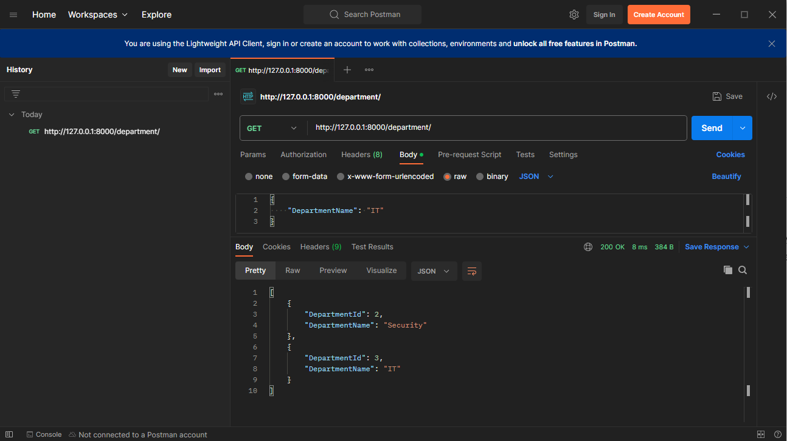

# Department and Employee Management

This is a fullstack project builded using Django API + Angular 16 + SQLite. The main purpose this project is to show a easy way for add, edit and delete records about employees and his departments. In this repository are the **backend files**.

# Setup

* Do the download/clone this project
* Create a virtual environment in Python
* Run the command:
	* pip install requirements.txt
* Create de migrations on data base:

~~~python
python manage.py makemigrations
python manage.py migrate
~~~
* Now let's run the project using:
~~~
pyhon manage.py runserver 
~~~

> **Note**: This only will be run with a API Platform like Postman, or downloading the front-end this project

# Testing the API
I used the postman to test but you can use the software of your choice. It's simple, you need pass the url(127.0.0.1:8000 -> the base port of Django), choice the method and run a JSON code.

